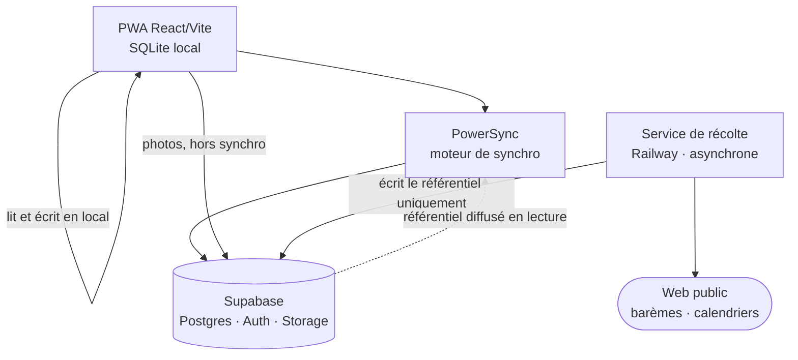
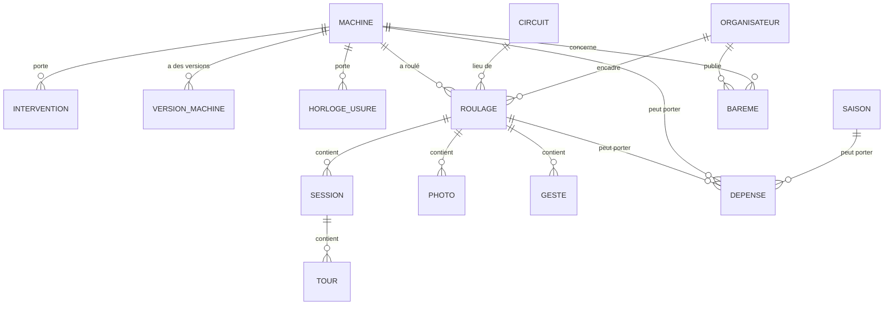

# Architecture Spine — MyPaddock

## Design Paradigm

**Local-first à source de vérité serveur**, avec un **satellite de récolte isolé**.

Ce n'est pas du local-first canonique, et la nuance est le cœur du contrat. Dans le local-first
classique l'appareil détient la vérité et le serveur réconcilie. Ici **le compte serveur détient la
saison** et le SQLite local est un **cache de travail** plus le tampon du hors-ligne. La raison est
au PRD : le mode de panne fatal n'est pas le paddock sans réseau, c'est *« j'ouvre en mars et ma
saison a disparu »*, et un appareil qu'on remplace ou dont le navigateur purge le stockage ne peut
pas être la vérité.

Ce que ça change concrètement : **la fenêtre de vulnérabilité est la journée**, de la saisie au
paddock au retour du réseau. Des heures. Toute l'ingénierie de robustesse se concentre là, et non
sur une réconciliation multi-appareils élaborée.

Le **satellite de récolte** est un second système, volontairement séparé : il ne partage ni le cycle
de vie, ni la disponibilité, ni le domaine d'écriture de l'application. Il produit du **référentiel**
que l'application consomme ; il ne touche jamais aux données d'un pilote.



**La direction des dépendances est une règle, pas un dessin.** La PWA ne connaît pas le service de
récolte. Le service de récolte ne connaît pas la PWA. Ils ne se rencontrent que dans Postgres, sur
des tables dont **un seul des deux est propriétaire** (AD-12).

---

## Invariants & Rules

### AD-1 — Le serveur détient la saison, le local détient la journée `[ADOPTED]`

- **Binds:** tout · NFR-1 à NFR-6
- **Prevents:** qu'une unité traite le SQLite local comme la vérité et construise une réconciliation
  pair-à-pair, pendant qu'une autre suppose le serveur autoritaire — deux modèles de conflit
  incompatibles dans le même produit.
- **Rule:** en cas de divergence non triviale, **le serveur gagne**, sauf pour les écritures locales
  non encore synchronisées, qui sont rejouées puis gagnent. Aucune unité n'implémente de résolution
  de conflit propre : c'est PowerSync qui la porte, entièrement.

### AD-2 — Le schéma porte deux axes indépendants et de premier rang `[ADOPTED]`

- **Binds:** modèle de données · FR-1 à FR-5
- **Prevents:** que la machine devienne une propriété du roulage — ce qui rendrait l'axe atelier
  inatteignable et se paierait en migration.
- **Rule:** `roulage` et `machine` sont deux racines. **Un roulage sans machine et une machine sans
  aucun roulage sont deux états valides et testés.** Aucune donnée de machine n'est atteignable
  uniquement par un roulage, ni l'inverse. Le garage contient plusieurs machines ; chaque roulage
  porte celle qui a roulé, en référence nullable.

### AD-3 — Un chrono porte sa provenance ; une session porte n tours

- **Binds:** modèle de session · FR-16 à FR-18 · NFR-13
- **Prevents:** qu'une unité modélise « un meilleur tour par roulage » en dur et qu'un import de
  chronomètre embarqué exige ensuite une réécriture du modèle.
- **Rule:** `session` a une collection de `tour`, même quand la v1 n'en écrit qu'un. Chaque `tour`
  porte `provenance ∈ {saisie_manuelle, chronometre_embarque, transpondeur_organisateur}`.
  **Le téléphone n'est jamais le capteur** — il n'y a pas de provenance GPS et il n'y en aura pas.
  Aucun affichage ne présente deux provenances comme équivalentes.

### AD-4 — Aucune donnée saisie n'existe uniquement sous forme de requête en attente `[ADOPTED]`

- **Binds:** tout chemin d'écriture · NFR-2
- **Prevents:** qu'une unité pousse une écriture dans une file de requêtes du Service Worker en
  croyant l'avoir enregistrée — la rétention par défaut de sept jours est très en deçà du cycle du
  produit.
- **Rule:** toute écriture atterrit d'abord dans SQLite local, **de façon transactionnelle et
  synchrone du point de vue de l'appelant**. La synchronisation lit cette base ; elle n'est jamais
  le lieu où la donnée existe. Aucune file de requêtes n'est utilisée pour des données métier.

### AD-5 — La persistance est demandée à chaque ouverture et son état est une donnée d'interface

- **Binds:** amorçage de la PWA · NFR-1
- **Prevents:** qu'on croie l'installation sur l'écran d'accueil suffisante — cette exemption n'est
  documentée nulle part ; ce que WebKit documente, c'est que le stockage en **mode persistant**
  échappe à l'éviction.
- **Rule:** `navigator.storage.persist()` est appelé à chaque démarrage, et `persisted()` alimente un
  état lisible par le pilote. Si la persistance est refusée, **la promesse de continuité n'est pas
  tenue et le produit ne le cache pas**.

### AD-6 — Rien ne s'exécute en arrière-plan ; la synchronisation a exactement deux déclencheurs

- **Binds:** ordonnancement de la synchronisation · NFR-3
- **Prevents:** qu'une unité s'appuie sur Background Sync ou Background Fetch — WebKit a refusé le
  premier et n'a jamais implémenté le second, qu'il recommande pourtant.
- **Rule:** la synchronisation part au **retour au premier plan** et au **retour de connectivité**,
  et nulle part ailleurs. Aucun calcul du produit ne suppose qu'il s'est passé quelque chose pendant
  que l'application était fermée — **l'accueil temporel se calcule à l'ouverture**, par
  construction.

### AD-7 — Une dépense a trois cibles de rattachement, toutes de premier rang

- **Binds:** modèle de coût · FR-21 à FR-27
- **Prevents:** qu'une unité indexe le coût sur le roulage — auquel cas la moitié du budget réel
  échappe au suivi et la clause « le coût au tour ne s'affiche jamais seul » devient inapplicable
  faute d'un budget complet.
- **Rule:** `depense.cible ∈ {roulage, machine, saison}`, exclusive et obligatoire. Une dépense sans
  roulage se rattache à la saison en cours si elle existe, **sinon à la saison à venir**.

### AD-8 — La saison est dérivée ; aucune branche ne teste un mois

- **Binds:** tout calcul temporel · FR-52, FR-53
- **Prevents:** qu'une unité code un « mode hiver » sur des dates de calendrier, ce qui serait faux
  pour un pilote qui roule en janvier.
- **Rule:** la saison se calcule du premier au dernier roulage saisi de l'année. **Aucune expression
  conditionnelle du code ne compare un mois de l'année**, et cette règle est vérifiable à la revue.
  Le produit teste des états — un roulage à venir ? un travail en cours ? — jamais une date.

### AD-9 — Le Niveau est la seule entrée du coefficient d'usure

- **Binds:** modèle de groupe et d'usure · FR-6, FR-6bis, FR-41, FR-42
- **Prevents:** qu'une unité tienne une table de noms de groupes — ils varient par organisateur, en
  nombre comme en libellé.
- **Rule:** un roulage stocke le **libellé de groupe de l'organisateur** et son **rang** (`n` sur
  `total`). Le rang se projette sur `Niveau ∈ {debutant, intermediaire, confirme, racer}`, et **seul
  le Niveau alimente le coefficient d'usure**, qui vaut 1 pour tous jusqu'à calibration.

### AD-10 — Le catalogue et le barème sont de la donnée versionnée, jamais du code

- **Binds:** achievements, barème constructeur · FR-30, FR-44, NFR-14
- **Prevents:** qu'un ajout d'achievement ou une correction de barème exige un redéploiement.
- **Rule:** les deux vivent en base, portent une version, et se diffusent par la synchronisation
  comme le reste. Aucune condition d'achievement n'est exprimée en code compilé ; elle est **une
  donnée évaluée** contre des valeurs déjà saisies.

### AD-11 — Toute donnée récoltée porte sa provenance, et la correction du pilote prime

- **Binds:** barème constructeur, calendriers · FR-44, FR-50, FR-51
- **Prevents:** qu'une extraction assistée par IA soit présentée comme une transcription. **C'est le
  seul endroit du produit où une erreur touche la sécurité d'une machine.** Une extraction est une
  reconstruction : elle peut se tromper de modèle, d'année, d'unité, ou inventer une échéance.
- **Rule:** toute ligne récoltée porte `source_url`, `date_recolte`, `methode ∈ {extraction_ia,
  saisie_humaine}`. L'interface affiche la mention d'extraction automatique ; elle n'est jamais
  reléguée en pied de page.
- **La correction du pilote ne vit pas dans le référentiel** — elle ne peut pas, AD-12 l'interdit.
  Elle est une **surcouche par pilote** (`bareme_correction`, table de pilote sous RLS) qui référence
  la ligne de référentiel corrigée. La lecture résout toujours *correction si elle existe, sinon
  référentiel*, et **une récolte ultérieure ne peut jamais écraser une correction**, puisqu'elle
  n'écrit pas dans la même table.

### AD-12 — Le service de récolte n'écrit jamais dans les données d'un pilote

- **Binds:** frontière PWA / récolte
- **Prevents:** deux propriétaires pour une même table, et un incident de récolte qui corromprait
  une saison.
- **Rule:** la récolte écrit **uniquement** dans les tables de référentiel (`bareme`, `organisateur`,
  `circuit`, `roulage_publie`), avec un rôle de base de données distinct qui n'a **aucun droit
  d'écriture** sur les tables de pilote. La PWA lit le référentiel et ne l'écrit jamais. Le
  référentiel est **public en lecture** ; les données de pilote sont protégées par RLS.

### AD-13 — La composition d'image a trois pièges silencieux, tous fermés

- **Binds:** récapitulatif · FR-33 à FR-37 · NFR-11, NFR-12
- **Prevents:** trois échecs qui ne lèvent aucune erreur visible au développement et cassent en
  production.
- **Rule:** la photo de fond est servie **depuis la même origine** ou avec un CORS correct, sinon
  l'export lève `SecurityError` ; `blob.type` est **vérifié après coup** plutôt que déduit du format
  demandé, qui peut être ignoré silencieusement ; et si la composition tourne dans un Worker, **les
  polices y sont ajoutées explicitement à `self.fonts`** — rien n'est hérité du document et
  l'ensemble démarre vide. Le partage teste `canShare` avec **l'objet exact** passé à `share()`,
  distingue `AbortError` (silence) de tout autre échec (chemin de repli visible), et **ne nomme
  aucune cible**.

### AD-14 — Les identifiants sont générés côté client

- **Binds:** modèle de données
- **Prevents:** qu'une unité attende un identifiant du serveur — impossible au paddock sans réseau,
  et toute la saisie en dépend.
- **Rule:** clés primaires en **UUID v7** générées localement. Aucune séquence, aucun auto-incrément,
  aucun identifiant attribué par le serveur sur une entité que le pilote peut créer hors ligne.
  L'ordre chronologique est porté par l'horodatage de l'UUID v7, jamais par l'ordre d'insertion.

### AD-15 — Aucun secret ne vit dans la PWA

- **Binds:** frontière de sécurité
- **Prevents:** qu'une clé d'API de fournisseur d'extraction ou une clé de service parte dans un
  paquet JavaScript public.
- **Rule:** la PWA ne détient que la clé publiable de Supabase, et l'accès aux données passe par RLS.
  **Toute clé de service et toute clé de fournisseur d'IA vivent dans le service de récolte**, qui
  n'est jamais appelé par un client.

### AD-16 — Les instruments de bord remontent, minimal et annoncé

- **Binds:** FR-57 à FR-60 · §7 du PRD
- **Prevents:** qu'une mesure conçue pour un utilisateur unique reste locale alors que
  l'acquisition payante amène des inconnus — une mesure qui ne remonte pas ne mesure rien chez eux.
- **Rule:** **exactement trois** mesures remontent — délai roulage → saisie, récapitulatifs générés
  contre postés, ouvertures sans saisie. Aucune autre. Aucun traceur tiers, aucun SDK publicitaire
  dans l'application. La remontée est annoncée et le pilote peut s'y opposer sans perdre de
  fonction.

### AD-17 — Le coût d'une machine est la somme des dépenses qui la désignent, et rien d'autre

- **Binds:** agrégation de coût · FR-21 à FR-27
- **Prevents:** deux unités qui calculent « le coût d'une machine » différemment — l'une en sommant
  `depense.cible = machine`, l'autre en remontant les dépenses des roulages où cette machine a
  roulé. **Les deux respectent AD-7 et AD-2 et produisent des chiffres différents.**
- **Rule:** le coût d'une machine est **exclusivement** la somme des dépenses dont la cible est cette
  machine. Les dépenses d'un roulage appartiennent au roulage, même quand ce roulage porte une
  machine. Un écran qui veut « tout ce que cette moto m'a coûté » demande une **union nommée et
  explicite**, jamais une jointure implicite.

### AD-18 — La saison budgétaire est une année, portée comme un entier

- **Binds:** modèle de coût et de bilan · FR-52 · AD-7, AD-8
- **Prevents:** qu'une dépense de cible `saison` pointe vers une entité qui n'existe pas — la saison
  est une vue dérivée (AD-8) et n'a aucune ligne à référencer. Une clé étrangère sans cible.
- **Rule:** `depense.saison_annee` est un **entier** (`2027`), jamais une référence. Les bornes de la
  saison restent dérivées des roulages ; l'appartenance budgétaire, elle, est un nombre stable qui
  ne bouge pas quand un roulage est ajouté ou supprimé. **La règle de rattachement d'AD-7 fixe cet
  entier au moment de la saisie et ne le recalcule jamais.**

### AD-19 — L'horloge d'usure avance par session, jamais par roulage

- **Binds:** usure · FR-8, FR-41, FR-42
- **Prevents:** deux unités qui avancent l'usure différemment — l'une comptant les roulages saisis,
  l'autre les sessions. FR-41 dit « roulages pondérés », FR-8 dit qu'une session écourtée change
  l'avancement : **les deux lectures sont défendables et incompatibles.**
- **Rule:** l'unité d'avancement est la **session**, pondérée par le Niveau du roulage qui la porte.
  Un roulage sans session saisie n'avance rien — **et c'est exactement ce que la complétude (FR-40)
  a pour rôle de dire au pilote.** Au noyau de décembre, où l'écourtement ne se déclare pas encore
  (FR-8), toute session compte pour une entière.

### AD-20 — Les instruments passent par le même chemin d'écriture que le reste

- **Binds:** instruments · FR-57 à FR-60 · AD-4, AD-16
- **Prevents:** qu'une unité ouvre un second canal vers le serveur pour la mesure — ce qui
  contournerait AD-4, perdrait les mesures faites hors ligne, et créerait un chemin d'écriture
  échappant à RLS.
- **Rule:** un événement d'instrument est **une donnée de pilote comme une autre** : écrit en local
  d'abord, synchronisé ensuite, protégé par RLS. Il n'existe **aucun appel réseau dédié à la
  mesure**, aucun SDK d'analytique, aucun point de terminaison de télémétrie. Le refus du pilote
  (AD-16) se traduit par **l'absence d'écriture locale**, pas par un filtrage côté serveur.

---

## Consistency Conventions

| Concern | Convention |
| --- | --- |
| **Nommage** | Le glossaire du PRD fait foi, **en français**, du schéma jusqu'à l'interface : `roulage`, `session`, `tour`, `machine`, `intervention`, `depense`, `geste`. Jamais `trackday`, jamais `lap`, jamais `bike`. Tables et colonnes en `snake_case` sans accent ; types et composants en `PascalCase` ; fichiers en `kebab-case`. |
| **Identifiants** | UUID v7 côté client (AD-14). |
| **Dates** | Stockage en UTC ISO 8601. **Un roulage porte en plus sa date locale nue** (`date_locale`, sans fuseau) : c'est un jour de calendrier vécu, pas un instant, et un roulage du 12 mai reste du 12 mai. |
| **Argent** | Entiers en **centimes**, jamais de flottant. Devise portée explicitement (EUR par défaut). |
| **Chronos** | Entiers en **millisecondes**. Le formatage `1'47"3` est une couche de présentation. |
| **Enums** | Chaînes en `snake_case`, jamais d'entier ordinal — un ordinal se réinterprète silencieusement. |
| **Mutation d'état** | Écriture locale transactionnelle, puis synchronisation (AD-4). **Aucune unité n'écrit directement vers Supabase** pour des données de pilote — sauf le téléversement de photo, qui va au stockage, hors du flux de synchronisation. |
| **Erreurs** | Une erreur porte ce qui s'est passé, **ce qui est conservé**, et ce qui va se passer. Jamais d'excuse, jamais de code nu à l'écran. |
| **Référentiel** | Lecture seule côté PWA, écriture réservée au rôle de récolte (AD-12). |
| **Configuration** | Aucun secret côté client (AD-15). Les valeurs qui changent sans redéploiement sont de la donnée, pas de l'environnement (AD-10). |
| **Branches** | `main` déployée, `dev` pour l'exploration — dont la page de test du partage (QO-3). |

---

## Stack

Vérifié sur le web le 18 août 2026. Le code en devient propriétaire dès qu'il existe.

| Name | Version |
| --- | --- |
| React + Vite | dernière stable `[ASSUMPTION — à épingler au premier commit]` |
| TypeScript | dernière stable |
| PowerSync (SDK web, SQLite wasm + OPFS) | dernière stable — **encore en bêta**, gratuit pendant celle-ci |
| Supabase — Postgres, Auth, Storage | géré, offre gratuite pour le POC |
| Railway — service de récolte | géré |
| Press Start 2P · Chakra Petch | intégrées en data URI, jamais depuis un CDN |
| Racing Catalogue *(ou Bungee Shade en repli SIL OFL)* | **licence personnelle uniquement — précondition à lever avant la première campagne (NFR-18)** |

---

## Structural Seed

### Le référentiel et les données de pilote ne se mélangent pas



`CIRCUIT`, `ORGANISATEUR` et `BAREME` sont du **référentiel** — écrits par la récolte, lus par tout
le monde. Le reste appartient au pilote. `SAISON` n'est pas une table : c'est une vue dérivée
(AD-8).

### Arbre source

```text
mypaddock/
  app/                  # la PWA — le seul artefact que le pilote installe
    src/
      domaine/          # entités, règles, calculs — aucune dépendance à React ni à PowerSync
      donnees/          # schéma local, requêtes, adaptateur de synchronisation
      ecrans/           # un dossier par surface de l'IA
      composants/       # les composants de DESIGN.md
      design/           # tokens, fontes en data URI
  recolte/              # le satellite — déployé sur Railway, jamais appelé par un client
    sources/            # un module par source (calendrier-piste, sites constructeurs)
    extraction/         # appels au fournisseur d'IA, validation, traçage de provenance
  supabase/
    migrations/         # schéma, RLS, rôles
```

**`domaine/` ne dépend de rien.** C'est la seule règle d'arborescence qui compte : les calculs
d'usure, de coût et de saison doivent être testables sans navigateur, sans base et sans réseau.

---

## Capability → Architecture Map

| Domaine PRD | Vit dans | Gouverné par |
| --- | --- | --- |
| §4.1 Socle, deux axes | `domaine/`, `supabase/migrations/` | AD-2, AD-14 |
| §4.2 Roulage · §4.4 Chronos | `domaine/`, `ecrans/roulage/` | AD-3, AD-4 |
| §4.3 Accueil temporel | `ecrans/accueil/` | AD-6, AD-8 |
| §4.5 Coût | `domaine/cout/` | AD-7 |
| §4.6 Gestes · §4.7 Photos | `domaine/`, Supabase Storage | AD-10, AD-4 |
| §4.8 Récapitulatif | `app/src/recap/` | AD-13 |
| §4.9 Cercle et carnet | à venir — mouvement 3 | AD-12 (carnet servi en lecture) |
| §4.10 Entretien · §4.11 Réparations | `domaine/machine/` | AD-9, AD-10, AD-11 |
| §4.12 Conformité | `recolte/` + lecture PWA | AD-11, AD-12 |
| §4.13 Saison et projection | `domaine/saison/` | AD-8 |
| §4.14 Instruments | `app/src/instruments/` | AD-16 |

---

## Deferred

**Le découpage du noyau en tâches, et sa confrontation au temps réel** — c'est QO-10, et c'est la
question ouverte la plus lourde du projet. Elle appartient à `bmad-create-epics-and-stories`, pas à
cette colonne vertébrale : une architecture ne peut pas dire si huit blocs tiennent en soirées d'ici
décembre. **À faire avant la première ligne de code**, et la règle de coupe du §10.1 du PRD existe
déjà avec son ordre.

**La stratégie de tests.** Le seul invariant posé ici est que `domaine/` doit être testable sans
navigateur ; ce qui s'y teste et à quel niveau se décide aux épiques.

**Le pipeline de déploiement et les environnements.** Vercel ou Railway pour la PWA, gestion des
migrations, environnement de recette : le produit a un utilisateur et deux branches, `main` et
`dev`. Décider plus tôt serait de la cérémonie.

**La conception de l'extraction elle-même** — quel fournisseur, quel format de sortie, quelle
validation. AD-11 fixe ce que toute ligne récoltée doit porter ; comment elle est obtenue est un
choix de `recolte/` qui n'engage aucune autre unité.

**La sortie de bêta de PowerSync et sa tarification.** Non chiffrée à ce jour. À surveiller avant la
première campagne publicitaire — un produit qui achète des installations pendant que sa couche de
synchronisation sort de bêta cumule deux inconnues de coût.

**Les préconditions réglementaires** (QO-11) — politique de confidentialité, base légale RGPD,
CGU, suppression de compte et export. Elles conditionnent la première publicité, pas
l'architecture ; AD-16 pose déjà le minimum côté mesure.

**Le carnet partagé lisible sans compte** (FR-38). Servi en lecture publique, mais son mécanisme —
lien signé, page rendue côté serveur, ou export statique — se décide au mouvement 3.
